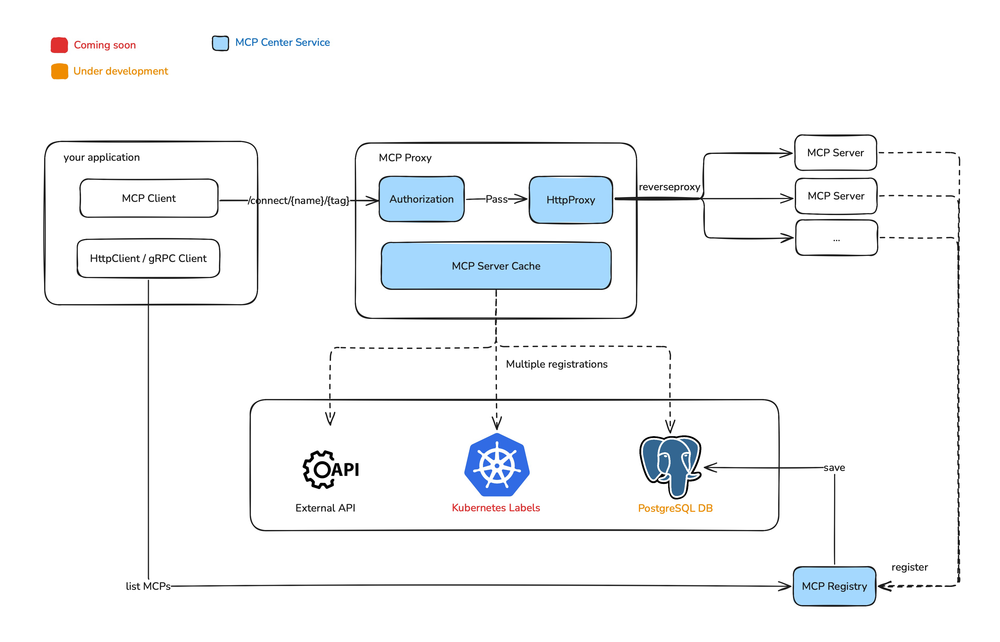

# MCP Center


A centralized platform for managing and connecting [MCP](https://modelcontextprotocol.io/) (Model Context Protocol) servers. MCP Center provides a high-performance proxy service that enables seamless communication between MCP clients and multiple MCP servers.

## Motivation

In our Kubernetes cluster, we have deployed various MCP Servers, including both in-house and third-party implementations, each running as independent services. Accessing these services currently requires configuring separate `K8s Ingress` or `Service Gateway` for each MCP Server, which increases operational complexity and maintenance overhead.

To address this, we propose a centralized MCP registry and reverse-proxy service that enables managed hosting of MCP Servers, which can be deployed either on `Docker` or `Kubernetes`. With this centralized service:

* **Service discovery** becomes unified, eliminating the need to configure access paths for each MCP Server individually.
* **Authentication** can be managed consistently across all MCP Servers, enhancing system security.
* **Leveraging a plugin system**, we can modify or filter MCP Tool parameters, enabling tool-level traceability and monitoring (see issue [#7](https://github.com/nautilus-ops/mcp-center/issues/7)).
* **Lifecycle management** of MCP Servers can be standardized, simplifying deployment, scaling, and upgrades.

This approach improves maintainability, provides a foundation for future features such as unified tracing, auditing, and monitoring, and allows organizations to easily manage and host MCP Servers across different environments.


## Architecture


## Features

- [x] **MCP SSE Transport Proxy** - Server-Sent Events transport support
- [x] **MCP Streamable Transport Proxy** - Streamable transport protocol support
- [x] **Multiple Registry Types** - Support for memory-based and external API registries
- [x] **High Performance** - Built with Axum proxy framework for optimal performance
- [x] **Kubernetes Ready** - Complete Helm chart for easy deployment

## Quick Start

### Using Docker


```bash
# 1. Pull the latest image
docker pull nautilusops/mcp-center:latest

# 2. Start the container
docker run -d \
  --name mcp-center \
  -p 5432:5432 \
  -e MCP_ADMIN_TOKEN=your-custom-token \
  -e POSTGRES_HOST=your-postgres-host \
  -e POSTGRES_PORT=your-postgres-port \
  -e POSTGRES_USERNAME=your-postgres-username \
  -e POSTGRES_PASSWORD=your-postgres-password \
  -e POSTGRES_DATABASE=your-postgres-database \
  nautilusops/mcp-center:latest
```

### Using Helm

Please see [here](docs/QUICK_START.md) to deploy with helm

### From Source

```bash
# Clone the repository
git clone https://github.com/nautilus-ops/mcp-center.git
cd mcp-center

# Build the project
cargo build --release

# Set environments
export MCP_ADMIN_TOKEN=your-custom-token
export POSTGRES_HOST=your-postgres-host
export POSTGRES_PORT=your-postgres-port
export POSTGRES_USERNAME=your-postgres-username
export POSTGRES_PASSWORD=your-postgres-password
export POSTGRES_DATABASE=your-postgres-database

# Run the application
./target/release/mcp-center run --config bootstrap.toml
```

## Usage Examples

### 1. Register MCP Server

```bash
curl -X POST http://localhost:5432/api/registry/mcp-server \
  -H "Content-Type: application/json" \
  -H "Authorization: Bearer your-admin-token" \
  -d '{
    "name": "my-mcp-server",
    "tag": "1.0.0",
    "endpoint": "http://my-server:8080/sse",
    "transport_type": "sse",
    "description": "My MCP server"
  }'
```

### 2. Get All MCP Servers

```bash
curl -X GET http://localhost:5432/api/registry/mcp-server \
  -H "Authorization: Bearer your-admin-token"
```

### 3. Connect to MCP Server via Proxy

```bash
curl -X GET http://localhost:5432/proxy/connect/my-mcp-server/1.0.0 \
  -H "Authorization: Bearer your-api-key"
```


## Development

### Prerequisites

- Rust 1.89.0 or later
- Docker (for containerized builds)
- Kubernetes cluster (for deployment testing)

### Building

```bash
# Development build
cargo build

# Release build
cargo build --release

# Docker build
docker build -t mcp-center .
```

### Testing

```bash
# Run unit tests
cargo test

# Run integration tests
cargo test --test integration

# Run with specific features
cargo test --features integration
```

## Contributing

1. Fork the repository
2. Create a feature branch (`git checkout -b feature/amazing-feature`)
3. Commit your changes (`git commit -m 'Add amazing feature'`)
4. Push to the branch (`git push origin feature/amazing-feature`)
5. Open a Pull Request

## License

This project is licensed under the Apache License, Version 2.0 - see the [LICENSE](LICENSE) file for details.

## Roadmap

- [x] **MCP Server Registry Center**: Centralized management of MCP server endpoints
- [ ] **Authentication & Authorization**: JWT-based authentication
- [ ] **Metrics & Monitoring**: Prometheus metrics and Grafana dashboards
- [ ] **Load Balancing**: Advanced load balancing algorithms
- [ ] **Rate Limiting**: Request rate limiting and throttling
- [ ] **Plugin System**: Extensible plugin architecture
